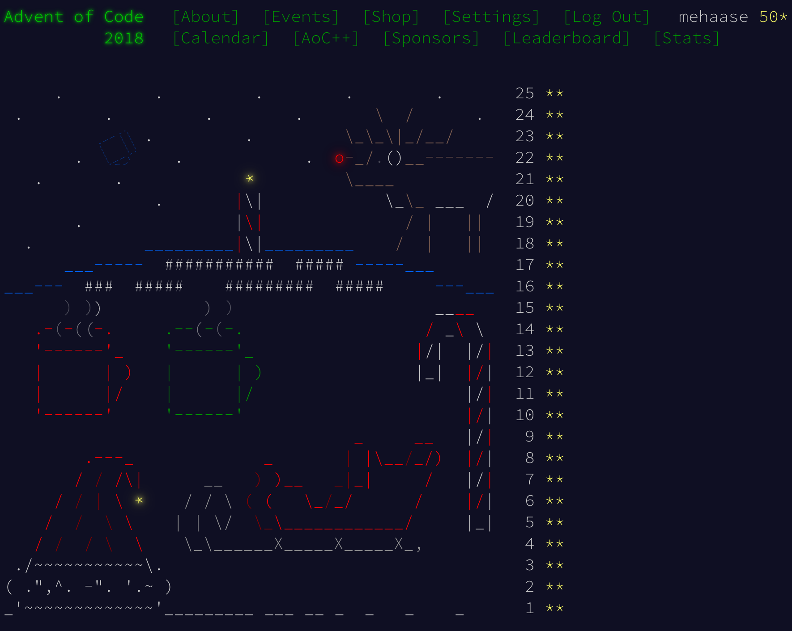

# Advent Of Code 2018: Python Solutions

This repository contains my solutions for [Advent Of Code 2018](https://adventofcode.com/2018/)
written in Python inside of Jupyter Notebook. You can view these notebooks right here on GitHub,
or download and run them yourself. The only external dependency is matplotlib.

These are not the fastest or most concise solutions, but I strived for clarity and careful
testing so as to reduce the amount of time I spent confusing myself. For this reason, you may
find my solutions helpful if you are stuck on a problem. My original inputs are included,
as well as output files in a few cases where visualizing the solution was helpful.

If you have questions, open an issue here on GitHub!

